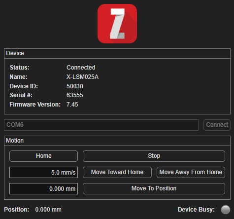

# MATLAB GUI for Controlling a Zaber Device

This example implements a simple MATLAB desktop app for controlling a single axis of a Zaber device.
The UI is built with MATLAB's [uifigure](https://www.mathworks.com/help/matlab/ref/uifigure.html) API.

## Hardware Requirements

Any Zaber linear motion device connected to the computer by serial port or USB.

## Dependencies

The app requires the [Zaber Motion Library toolbox](https://software.zaber.com/motion-library/docs/tutorials/install/matlab) (version `>=8.4.0`).
Additionally, building the app as a Windows desktop application requires access to [MATLAB Compiler](https://www.mathworks.com/products/compiler.html).

This code example has been tested with MATLAB R2026a.

## Configuration

The serial port can be entered into the input box after startup.
Optionally, you can edit the following constants at the top of [src/desktop_app.m](./src/desktop_app.m):

- `DEVICE_ADDRESS`: The device address of the device you'd like to connect to
- `AXIS_NUMBER`: The axis number of the axis you'd like to control on the device (1 for most integrated devices)

## Running the App

In MATLAB, navigate to this example's `src` directory and run `desktop_app`. The app runs on any platform.

## About the Code

This is an example of a [programmatic app](https://www.mathworks.com/help/matlab/creating_guis/create-and-run-a-simple-programmatic-app.html).
If you are building a GUI with the [App Designer](https://www.mathworks.com/products/matlab/app-designer.html) tool,
the generated code will be structured differently but the same concepts apply.

All motion commands are sent with `waitUntilIdle` set to `false` so the UI stays responsive while the axis moves.
A timer is set up to poll the axis position and call `zaber.motion.Helper.pollEvents`,
which is necessary for propagating the alert events used by the lamp component.
The lamp indicates the busy status of the device, lighting up green while the axis is moving: it is switched on after each
motion command is sent and switched off when the program receives an alert callback whose status is NOT `'BUSY'`.
If the program receives any kind of error, it is displayed at the bottom of the window.

## Building the App as a Windows Desktop Application

MATLAB Compiler can package a MATLAB program as a Windows desktop application using the [compiler.build.standaloneWindowsApplication](https://www.mathworks.com/help/compiler/compiler.build.standalonewindowsapplication.html) function.
Unlike a standalone console application, a desktop application does not open a console window when launched, which makes it a better fit for GUI programs.
Note that this build function is only supported on Windows.

The [build_windows_desktop_app.m](./build_windows_desktop_app.m) script configures the build, most importantly
assigning `zaber.motion.Helper.getCompilerDependencies()` to the `AdditionalFiles` option so that the
Zaber Motion Library's binary dependencies are packaged with the app. This is explained in more detail in the
[Packaging Zaber Motion Library with MATLAB Compiler](../util_matlab_compiler/README.md) example.
The script also sets the `ExecutableSplashScreen` option so that a splash image is displayed while the
MATLAB Runtime loads, which can take several seconds.

**Note**: The build entry point can also be an App Designer file (`*.mlapp`) instead of a `*.m` script.

To build the desktop application, either:

- Open the `gui_matlab_uifigure` directory in your MATLAB IDE and run `build_windows_desktop_app`.
- In the command line, navigate to the `gui_matlab_uifigure` directory and run `matlab -batch build_windows_desktop_app`.

The script places the packaged application in the `ZaberDesktopApp/output/build` folder.

After building, the script also creates an installer for the app using [compiler.package.installer](https://www.mathworks.com/help/compiler/compiler.package.installer.html)
and places it in the `ZaberDesktopApp/output/installer` folder.
Running the installer on a target machine installs the app along with the MATLAB Runtime,
so end users don't need a MATLAB license.
The `RuntimeDelivery` option controls whether the installer downloads the runtime during
installation (`"web"`, the default, which keeps the installer small) or embeds it (`"installer"`,
which makes the installer several gigabytes but works offline).

To run the application, either run `ZaberDesktopApp.exe` directly from the `ZaberDesktopApp/output/build` folder,
or run the installer and then launch the app like any other Windows application.
