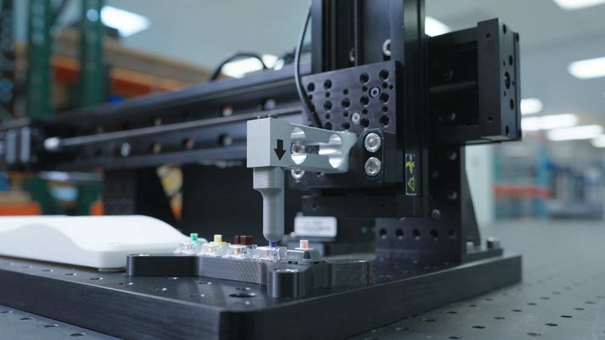

# Python Scripts for Integrating Load Cells with Zaber Motion: 3 Use Cases



A modular Python project demonstrating force-controlled motion operations using the Zaber motion system. This project includes three main demonstrations: **tactile profiling**, **compression test**, and **surface mapping** operations, all controlled via load cell feedback with automatic data recording and visualization.

The accompanying articles on integrating load cells with Zaber systems are listed below:

- [Surface Mapping](https://www.zaber.com/articles/tactile-surface-mapping)
- Tactile Profiling: Integration guide coming soon!
- Compression Test: Integration guide coming soon!

The codebase is modular, making it easy to extract and reuse specific operations for your own applications.

## Features

- **Modular Design**: Features are decoupled. You can run the entire suite via the interactive CLI, or copy standalone scripts for specific tasks into your own codebase.
- **Complete force control demonstrations**: Real-time feedback with configurable PID tuning.
- **Automatic data recording**: Utilizes the Zaber oscilloscope functionality.
- **Built-in plotting**: Generates force/position profiles using `matplotlib`.
- **Hardware trigger integration**: For safety and contact detection automation.

## Overview

This project interfaces with a Zaber X-MCC motion controller equipped with:

- A force-controlled Z-axis (vertical movement).
- A translation X-axis (horizontal movement).
- A load cell for force feedback connected to analog input port 1.

### 1. Tactile Profiling

Measures the force–displacement profile of a device (for example, a keyboard switch). Moves until a bottom-out condition is detected via a hardware trigger, records force vs. position data, and generates a tactile curve plot.

### 2. Compression Test

Applies a controlled force to an object and holds it at a specified setpoint. Uses PID tracking to maintain force, records force vs. position data, and generates a plot of the force profile during compression.

### 3. Surface Mapping

Maintains a constant force setpoint while moving the translation axis across a surface. Records position data from both axes to generate a 2D scan profile of the surface contour. Uses conservative PID settings for initial contact, then switches to responsive settings for tracking.

## System Requirements

- Python 3.12+
- Zaber X-MCC motion controller
- Zaber Motion Library
- Load cell connected to an X-MCC analog input
- `matplotlib` and `numpy`

## Installation

### Using uv

1. Clone or download this project.
1. Install all dependencies with a single command:

```bash
cd path/to/force-mode-demo
uv sync
```

This will install the dependencies and register the `force-mode-demo` command.

## Hardware Setup & Global Configuration

Hardware connection details and global calibration constants are managed in `src/force_mode_demo/config.py`.

1. Update serial port configuration:

    ```python
    XMCC_CONFIG = DeviceSetup(
        serial_port="COM5",  # Change to your device's serial port
        force_axis_index=2,    # Axis connected to force control
        translation_axis_index=1,
    )
    ```

1. Calibrate the load cell:

    ```python
    LOAD_CELL_CONFIG = LoadCellSetup(
        lc_slope_n_per_v=2.35,  # Replace with actual calibration lc_slope_n_per_v [N/V]
        lc_offset_v=0.65,       # Replace with actual calibration lc_offset_v [V]
        lc_max_force_n=20.0,    # Safe maximum force [N]
        mcc_analog_in=1,        # X-MCC analog input port connected to load cell
    )
    ```

## Project Structure

```text
src/force_mode_demo/
├── main.py                 # Main interactive CLI menu for all demos
├── config.py               # Global hardware config (XMCC_CONFIG, LOAD_CELL_CONFIG)
├── models.py               # Data models and conversion helpers
├── plot.py                 # Shared plotting utilities
├── compression/
│   ├── compression_logic.py
│   └── compression_run.py
├── tactile/
│   ├── tactile_logic.py
│   └── tactile_run.py
└── mapping/
    ├── mapping_logic.py
    └── mapping_run.py
```

## Running the Demos

You can run the examples in two ways: via the interactive menu, or as standalone scripts.

### 1. Interactive Menu

To explore all features from a single unified prompt, run:

```bash
uv run force-mode-demo
```

(Or `uv run src/force_mode_demo/main.py` if running without installing the package.)

### 2. Standalone Execution (Modular Reuse)

If you only want to use one specific feature, you can run its standalone runner script directly. These runner scripts establish their own connections, making them perfect templates to copy-paste into your own application.

**Run the Compression Test Demo:**

```bash
uv run src/force_mode_demo/compression/compression_run.py
```

**Run the Tactile Profiling Demo:**

```bash
uv run src/force_mode_demo/tactile/tactile_run.py
```

**Run the Surface Mapping Demo:**

```bash
uv run src/force_mode_demo/mapping/mapping_run.py
```

## Demo-Specific Configuration

To adjust the PID tuning, movement speeds, safety limits, and thresholds for a specific demo, edit its respective runner file.
For example, to change the `COMPRESSION` operation parameters, edit `COMPRESSION_CONFIG` located inside [src/force_mode_demo/compression/compression_run.py](src/force_mode_demo/compression/compression_run.py).

## Safety Considerations

- Always set appropriate **lc_max_force_n** limits to prevent equipment damage.
- Test with low force values first.
- Verify load cell calibration before running operations.
- Monitor the device during initial test runs.
- The tactile profiling operation uses hardware triggers for automatic stopping when contact is detected. Ensure triggers are correctly configured for your hardware.
